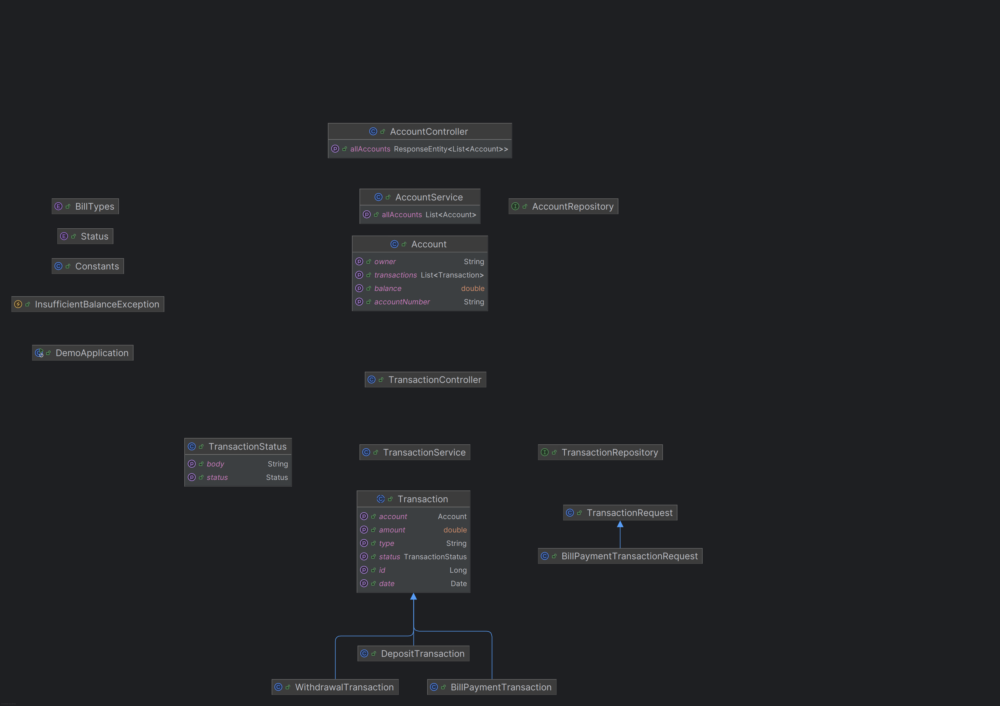

# Getting Started with Simple Banking 
Implemented a simple banking application with given instructions. Project containerized with docker. Used Spring Boot, JPA, Flyway and Docker tech stack. Used postgresql for database in a docker container.

## Task 1: Implement and test the model
Implemented Account and Transaction models. Tests were written for all models and controllers. 

### BONUS Task 1: Find a better implementation alternative
Strategy pattern implemented for applying transaction to account. Every transaction model that extends Transaction class must override apply(Account account) function and implements its own logic in there. Thus, the account class only calls the apply function of the transaction object posted to it and sends its own instance as a parameter.
When a new transaction is added, it will only be sufficient to inherit from the Transaction abstract class and implement this function.

## Task 2:  Provide a REST API using Spring Rest Controllers and TEST

Implemented a rest controller for each service. These controllers controls only their own responsibility. Used springdoc for swagger documentation and manual testing. Used docker compose for startup project. You can start project manually in IDE (do not forget to run postgres container for db connection before) or simply use docker compose. 

Swagger doc:
```yaml
openapi: 3.0.1
info:
  title: OpenAPI definition
  version: v0
servers:
- url: http://localhost:8080
  description: Generated server url
paths:
  /api/v1/account/create:
    put:
      tags:
      - account-controller
      operationId: createAccount
      parameters:
      - name: owner
        in: query
        required: true
        schema:
          type: string
      responses:
        "200":
          description: OK
          content:
            '*/*':
              schema:
                type: object
  /api/v1/transaction/withdrawal:
    post:
      tags:
      - transaction-controller
      operationId: withdrawal
      requestBody:
        content:
          application/json:
            schema:
              $ref: '#/components/schemas/TransactionRequest'
        required: true
      responses:
        "200":
          description: OK
          content:
            '*/*':
              schema:
                $ref: '#/components/schemas/TransactionStatus'
  /api/v1/transaction/deposit:
    post:
      tags:
      - transaction-controller
      operationId: deposit
      requestBody:
        content:
          application/json:
            schema:
              $ref: '#/components/schemas/TransactionRequest'
        required: true
      responses:
        "200":
          description: OK
          content:
            '*/*':
              schema:
                $ref: '#/components/schemas/TransactionStatus'
  /api/v1/transaction/billPayment:
    post:
      tags:
      - transaction-controller
      operationId: billPayment
      requestBody:
        content:
          application/json:
            schema:
              $ref: '#/components/schemas/BillPaymentTransactionRequest'
        required: true
      responses:
        "200":
          description: OK
          content:
            '*/*':
              schema:
                $ref: '#/components/schemas/TransactionStatus'
  /api/v1/account/update:
    post:
      tags:
      - account-controller
      operationId: updateAccount
      requestBody:
        content:
          application/json:
            schema:
              $ref: '#/components/schemas/Account'
        required: true
      responses:
        "200":
          description: OK
          content:
            '*/*':
              schema:
                type: object
  /api/v1/account/delete/{id}:
    post:
      tags:
      - account-controller
      operationId: deleteAccount
      parameters:
      - name: id
        in: path
        required: true
        schema:
          type: string
      responses:
        "200":
          description: OK
          content:
            '*/*':
              schema:
                type: object
  /api/v1/account/get_by_id/{id}:
    get:
      tags:
      - account-controller
      operationId: getAccount
      parameters:
      - name: id
        in: path
        required: true
        schema:
          type: string
      responses:
        "200":
          description: OK
          content:
            '*/*':
              schema:
                type: object
  /api/v1/account/get_all:
    get:
      tags:
      - account-controller
      operationId: getAllAccounts
      responses:
        "200":
          description: OK
          content:
            '*/*':
              schema:
                type: array
                items:
                  $ref: '#/components/schemas/Account'
components:
  schemas:
    TransactionRequest:
      type: object
      properties:
        accountNumber:
          type: string
        amount:
          type: number
          format: double
    TransactionStatus:
      type: object
      properties:
        status:
          type: string
          enum:
          - OK
          - FAIL
        body:
          type: string
    BillPaymentTransactionRequest:
      type: object
      properties:
        accountNumber:
          type: string
        amount:
          type: number
          format: double
        billType:
          type: string
          enum:
          - GSM
          - INTERNET
          - WATER
          - GAS
          - ELECTRIC
    Account:
      type: object
      properties:
        accountNumber:
          type: string
        owner:
          type: string
        balance:
          type: number
          format: double
        transactions:
          type: array
          items:
            $ref: '#/components/schemas/Transaction'
    Transaction:
      type: object
      properties:
        id:
          type: integer
          format: int64
        date:
          type: string
          format: date-time
        type:
          type: string
        amount:
          type: number
          format: double
        account:
          $ref: '#/components/schemas/Account'
        status:
          $ref: '#/components/schemas/TransactionStatus'
```

